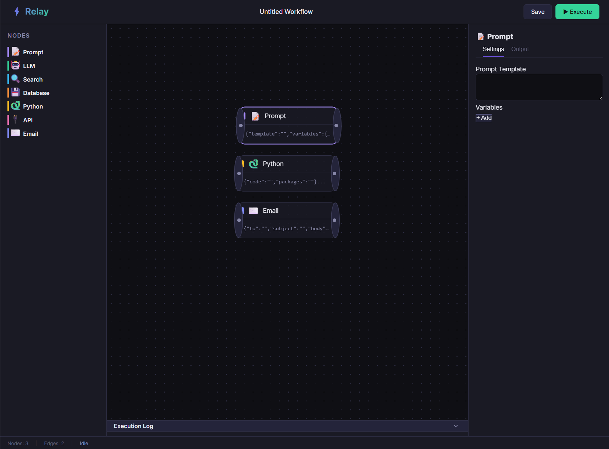

# Relay Workflow Builder

Relay is a lightweight, intuitive drag-and-drop workflow builder designed for composing 
and executing AI pipelines. It provides an interactive canvas to connect various nodes 
(like LLMs, Prompts, Web Searches, and local Python scripts) to automate complex AI tasks.

Traditional scripts look fine for linear tasks but fall apart under complex branching
logic — this provides the visual orchestration needed to manage that gap.

## How it works

```
palette + canvas ──▶ node graph ──▶ topological sort ──▶ execution engine ──▶ outputs
                                      ▲
                                 cycle detection
```

Per execution: the engine **validates** the workflow (ensuring no cycles exist), 
sorts the nodes topologically, and fires off execution sequentially. The UI updates 
in real-time, showing running states and inline results.

## Setup

Needs [Node.js](https://nodejs.org/) running locally with an `.env` file configured:

```bash
git clone <repo>
cd RelayWorkflowBuilder
npm install
```

The application relies on API keys for external services (DeepSeek, DuckDuckGo, SendGrid). 
Ensure your `.env` contains the required keys.

## Run it

Development Server:

```bash
npm run dev:all
```

This concurrently spins up the Vite frontend (`localhost:5173`) and the Express backend (`localhost:3001`).

Web dashboard:

Open your browser to `http://localhost:5173`. 
Pick nodes from the sidebar, drag them onto the canvas, connect their inputs and outputs, 
and hit **Execute**. You can track the progress turn by turn in the live execution log.



## Workflows are JSON

A workflow is data conforming to a strict state schema managed by our reactive store. 

```json
{
  "name": "Untitled Workflow",
  "nodes": {
    "node_123": {
      "type": "prompt",
      "position": { "x": 100, "y": 200 },
      "data": { "template": "Translate {{text}} to French" },
      "status": "idle"
    }
  },
  "edges": {
    "edge_456": {
      "source": "node_123",
      "target": "node_789",
      "targetHandle": "input"
    }
  }
}
```

**Node Types** (The building blocks of Relay):

| type | purpose | execution |
|-------|------|----------------|
| `prompt`   | Template engine   | Interpolates variables into prompts |
| `llm`      | AI Generation     | Calls DeepSeek API |
| `search`   | Web Search        | DuckDuckGo integration |
| `database` | Postgres Query    | Simulated SQL execution |
| `python`   | Code execution    | Local sandboxed script runner |
| `api`      | REST requests     | Generic HTTP client |
| `email`    | Notifications     | SendGrid email dispatcher |


Validation fails loud before execution if the graph contains cycles, ensuring infinite loops are caught instantly.

## Outputs & Feedback

- **Success** — Node executed perfectly, inline JSON/text preview is rendered, full output is in the config panel.
- **Running** — Node is currently awaiting response from the backend (with glowing CSS pulse).
- **Error** — Execution failed, error message displayed directly on the node card.

Signals are immediate and visual over the workflow — no digging through terminal logs required.

## Layout

```
src/main.js               Entry point, layout initialization
src/store.js              Reactive state manager and store definition
src/canvas/               Node rendering, edge rendering (SVG bezier), panning/zooming
src/panels/               Config panel, node palette, topbar, status bar, log panel
src/engine/               Topological sorting, graph validation, and API dispatching
src/nodes/                Node registry and schema definitions
server/index.js           Express server entry point
server/routes/            Execution routing endpoint
server/handlers/          Backend logic for LLMs, DBs, Python scripts, etc.
tests/                    Jest suite for validation and backend handlers
index.html                Single-page application markup
```

## Tests

```bash
npm test                  # runs the Jest suite (graph validation, engine, backend handlers)
```
